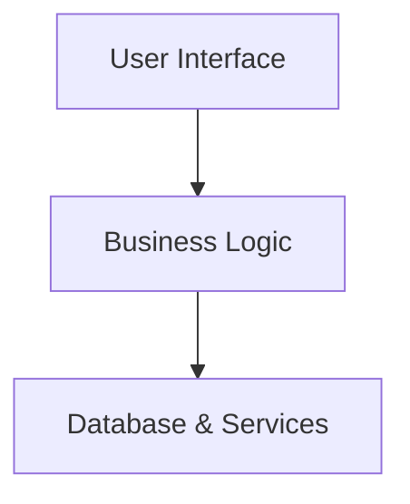

# Architecture Documentation

## 1. Project Overview

Bits 'N Speeches is a Next.js web application for managing a Toastmasters club. It includes a public website, a member portal, and an officer portal in a single application.

The goal is to replace multiple disconnected tools for tasks like RSVPs, meeting roles, member resources, and membership management with one centralized platform. User authentication and data are managed through Supabase and PostgreSQL.

The application is built with Next.js (App Router) and TypeScript. It uses Tailwind CSS and shadcn/ui for the interface, TanStack Query for data fetching, React Hook Form and Zod for forms and validation, and Supabase for authentication, the database, and file storage.

## 2. Core Principles

- **Separation of responsibilities**: Pages are responsible for displaying the UI. Business logic and data fetching are kept in `features/` and `lib/`.
- **Data flow**: Data is fetched from Supabase using TanStack Query and passed down to components. Components don't update the database directly.
- **Performance**: Database requests run on the server whenever possible so the UI stays fast and responsive.

## 3. System Architecture

## 4. Project Structure

- `app/` — Pages, layouts, and routes for the public website, member portal, and officer portal.
- `src/components/` — Reusable UI components, including shadcn/ui components.
- `src/features/` — Feature-specific logic, such as meetings, membership, roles, and resources.
- `src/lib/` — Supabase setup, shared services, and utility functions.
- `src/hooks/` — Shared React hooks, including TanStack Query hooks.
- `src/types/` — Shared TypeScript types and Zod validation schemas.
- `src/utils/` — Helper functions used across the project.
- `src/styles/` — Global Tailwind CSS styles.

## 5. Main Files

- `app/layout.tsx` — Sets up the application's global layout and providers.
- `app/page.tsx` — Public website home page.
- `next.config.ts` — Next.js configuration.

## 6. Architecture Decisions

- **Single application (Current)**: The public website, member portal, and officer portal currently live in a single Next.js application to reduce complexity and speed up development. The project is organized into independent features so it can be split into separate applications in the future if the platform expands to support multiple clubs or standalone products.

- **Supabase**: Supabase is used for authentication, the PostgreSQL database, and file storage, allowing the project to avoid building a custom backend.
